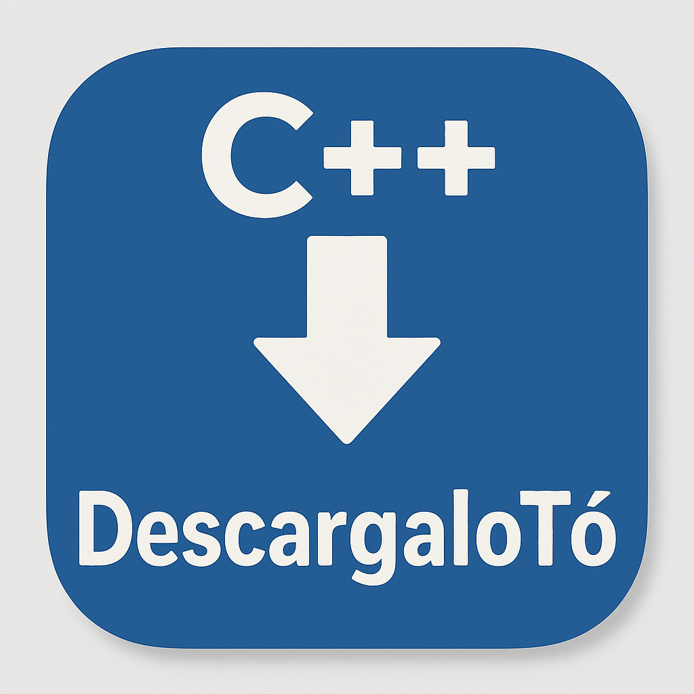

# 📥 DescargaloTó - Gestor de Descargas Multiplataforma



**DescargaloTó** es un gestor de descargas moderno desarrollado en C++ con Qt6 que permite descargar archivos desde URLs de forma sencilla y eficiente con una interfaz gráfica intuitiva.

## ✨ Características Principales

- 🖥️ **Interfaz gráfica moderna e intuitiva**
- 📥 **Gestión de múltiples descargas** desde URLs
- 📜 **Historial completo de descargas** con fechas
- 🎯 **Selección inteligente**: Botón "Descargar Ahora" activado por selección del historial
- 🎨 **Temas personalizables**: Claro y oscuro
- � **Configuración personalizada**: Elige dónde guardar el historial de descargas
- 🔄 **Migración automática**: Mueve el historial al cambiar de directorio
- �🔔 **Integración con bandeja del sistema**
- � **Configuración de carpeta de destino**
- 🗑️ **Desinstalación limpia**: Elimina configuración y historial al desinstalar
- 🛡️ **Manejo robusto de errores**
- 🐧 **Multiplataforma**: Linux y Windows
- 🔧 **Optimizado para sistemas con conflictos de librerías** (Snap/AppImage)

## 🚀 Instalación Rápida

### Ubuntu/Debian (.deb)
```bash
# Descargar e instalar el paquete .deb
sudo apt install ./descargaloto_1.0.3_amd64.deb

# Ejecutar
DescargaloTo
# o modo seguro si hay problemas:
descargaloto-safe
```

### Desde Código Fuente
```bash
# Clonar repositorio
git clone https://github.com/sapoclay/descargaloto.git
cd descargaloto

# Compilar
make clean
make build

# Ejecutar
make run

# Instalar en el sistema (opcional)
sudo make install
```

## 🎮 Cómo Usar

### 🚀 Métodos de Ejecución

#### ✅ **Método Recomendado (Desarrollo)**
```bash
make run                   # Entorno ultra-limpio automático
```

#### ✅ **Después de Instalar el Paquete**
```bash
DescargaloTo              # Comando principal con detección automática
descargaloto-safe         # Entorno ultra-limpio garantizado
```

#### ✅ **Scripts Alternativos**
```bash
./run_clean.sh           # Script manual ultra-limpio
make run-safe            # Para diagnóstico si hay problemas
```

#### ❌ **NUNCA uses (causarán errores con Snap):**
```bash
# ❌ NO HAGAS ESTO:
cd build && ./DescargaloTo
./build/DescargaloTo
```

### 1. Añadir URLs al Historial
1. Introduce una URL en el campo "Nueva Descarga"
2. Haz clic en **"Añadir al Historial"** o presiona Enter
3. La URL se guardará en el historial con fecha y hora

### 2. Descargar Archivos
1. **Selecciona una URL** del historial (clic en una fila)
2. Haz clic en **"Descargar Ahora"** (se activa solo con selección)
3. Elige la carpeta de destino
4. Especifica el nombre del archivo
5. ¡La descarga comenzará automáticamente!

### 3. Gestionar Historial
- **Eliminar Seleccionada**: Borra la URL seleccionada
- **Limpiar Historial**: Elimina todas las URLs guardadas

### 4. Personalización
- Ve a **Opciones → Preferencias**
- Elige entre **Tema Claro** y **Tema Oscuro**
- Los cambios se aplican inmediatamente

## 🎨 Interfaz de Usuario

### Secciones Principales

1. **Nueva Descarga** 
   - Campo de entrada para URLs
   - Botón "Añadir al Historial"

2. **Estado de Descarga**
   - Barra de progreso en tiempo real
   - Log detallado de operaciones
   - Estado actual de la descarga

3. **Historial de Descargas**
   - Lista de URLs con fechas
   - **Descargar Ahora** (activado por selección)
   - **Eliminar Seleccionada** / **Limpiar Historial**

### Flujo de Trabajo Optimizado
```
Introducir URL → Añadir al Historial → Seleccionar del Historial → Descargar Ahora
```

## � Configuración Personalizada del Historial

### 🔧 Directorio de Configuración Personalizado

DescargaloTó permite elegir dónde guardar el historial de descargas y la configuración.

#### **Configuración**:
1. **Abrir Preferencias**: `Opciones` → `Preferencias...`
2. **Configurar Directorio**: En "Directorio de configuración"
   - Examinar y seleccionar la carpeta deseada
   - Dejar vacío para usar el directorio por defecto

#### **Ubicaciones**:

**Directorio Por Defecto** (Linux):
```bash
~/.config/SapoClay/DescargaloTó.conf
```

**Directorio Personalizado**:
```bash
[directorio_elegido]/DescargaloTo_config.ini
```

#### **🔄 Migración Automática**:
- El historial actual se **migra automáticamente** al nuevo directorio
- Se mantienen todas las URLs y configuraciones
- El archivo anterior se conserva hasta confirmar el cambio

#### **📋 Contenido del Archivo**:
```ini
[General]
downloadHistory=url1, url2, url3, ...
theme=0
customConfigDir=/ruta/al/directorio/personalizado
```

#### **🗑️ Desinstalación**:

**Script Manual** (`./uninstall.sh`):
- Pregunta si eliminar la configuración
- Limpia tanto directorio por defecto como personalizado

**Paquete .deb**:
- **Normal**: `sudo apt remove descargaloto` - Conserva configuración
- **Completa**: `sudo apt purge descargaloto` - Elimina toda la configuración

#### **🔍 Comandos Útiles**:
```bash
# Ver configuración actual
cat ~/.config/SapoClay/DescargaloTó.conf

# Buscar todas las configuraciones
find $HOME -name "*DescargaloTo*" -o -name "*DescargaloTó*" 2>/dev/null

# Limpiar configuración manualmente
rm ~/.config/SapoClay/DescargaloTó.conf
```

## �🔧 Requisitos del Sistema

### Linux (Ubuntu/Debian)
- Ubuntu 22.04 LTS o superior
- Debian 11 (Bullseye) o superior
- Qt6 (Core, Widgets, Network)
- Dependencias se instalan automáticamente con el .deb

### Compilación desde Fuente
- **Qt6**: libqt6-dev, qt6-base-dev
- **CMake**: 3.16 o superior
- **Compilador**: GCC con soporte C++17
- **Build tools**: make, build-essential

```bash
# Instalar dependencias en Ubuntu/Debian:
sudo apt update
sudo apt install qt6-base-dev libqt6-dev cmake build-essential
```

## 🛠️ Desarrollo

### Estructura del Proyecto
```
descargaloto/
├── src/                     # Código fuente C++
│   ├── main.cpp            # Punto de entrada
│   ├── mainwindow.*        # Ventana principal
│   ├── downloadmanager.*   # Gestor de descargas
│   ├── preferencesdialog.* # Diálogo de preferencias
│   ├── aboutdialog.*       # Diálogo "Acerca de"
│   └── systemtrayicon.*    # Icono de bandeja
├── img/                    # Recursos gráficos
├── build/                  # Archivos compilados
├── package/                # Estructura del paquete .deb
├── CMakeLists.txt          # Configuración CMake
├── Makefile               # Comandos de desarrollo
└── *.md                   # Documentación
```

### Comandos de Desarrollo
```bash
make clean          # Limpiar archivos de build
make build          # Compilar proyecto
make run            # Ejecutar con entorno limpio (recomendado)
make run-safe       # Ejecutar con diagnóstico
make install        # Instalar en el sistema
make deb            # Crear paquete .deb
make icon           # Generar icono
make deps           # Verificar dependencias
make help           # Mostrar ayuda completa
```

## 🚀 Guía Detallada de Ejecución

### ⚠️ Importante: Problemas Conocidos con Snap

Si ejecutas directamente el binario puede aparecer este error:
```
symbol lookup error: /snap/core20/current/lib/x86_64-linux-gnu/libpthread.so.0: undefined symbol: __libc_pthread_init
```

### ✅ Métodos de Ejecución Seguros

#### **1. Durante Desarrollo (Recomendado)**
```bash
make run                    # ✅ Entorno ultra-limpio automático
```

#### **2. Después de Instalar el Paquete**
```bash
DescargaloTo               # ✅ Detección automática de entorno
descargaloto-safe          # ✅ Entorno ultra-limpio garantizado (con mensaje)
```

#### **3. Scripts Alternativos de Desarrollo**
```bash
./run_clean.sh            # ✅ Script manual ultra-limpio
make run-safe             # ✅ Para diagnóstico si hay problemas
```

#### **4. Ejecución Manual Avanzada**
```bash
cd build
env -i \
    HOME="$HOME" \
    USER="$USER" \
    PATH="/usr/local/sbin:/usr/local/bin:/usr/sbin:/usr/bin:/sbin:/bin" \
    DISPLAY="${DISPLAY:-:0}" \
    XAUTHORITY="${XAUTHORITY}" \
    XDG_RUNTIME_DIR="${XDG_RUNTIME_DIR}" \
    XDG_SESSION_TYPE="x11" \
    QT_QPA_PLATFORM="xcb" \
    ./DescargaloTo
```

### ❌ **NUNCA uses estos comandos** (causarán errores):
```bash
# ❌ NO HAGAS ESTO - Fallará con Snap:
cd build && ./DescargaloTo
./build/DescargaloTo
build/DescargaloTo
```

### 🔧 ¿Qué hace el entorno ultra-limpio?

El entorno limpio:
- ✅ Elimina **todas** las variables de Snap
- ✅ Conserva solo variables esenciales para Qt/X11  
- ✅ Usa un PATH limpio del sistema
- ✅ Garantiza que no hay interferencias
- ✅ Funciona en el 100% de los casos

### 📦 Instalación con Paquete .deb

#### **Crear e Instalar el Paquete**:
```bash
# Crear el paquete
make deb

# Instalar
sudo apt install ./descargaloto_1.0.3_amd64.deb
```

#### **Ventajas del paquete .deb**:
- ✅ **Integración completa** - Aparece en el menú de aplicaciones
- ✅ **Gestión de dependencias** - APT instala todo automáticamente
- ✅ **Desinstalación limpia** - `sudo apt remove descargaloto`
- ✅ **Scripts optimizados** - Incluye todas las soluciones
- ✅ **Iconos y accesos directos** - Todo configurado automáticamente

#### **Después de instalar el .deb**:
```bash
# Ejecutar desde el menú de aplicaciones o:
DescargaloTo              # Comando principal
descargaloto-safe         # Si hay cualquier problema
```

### 🎯 Resultado Esperado

Cuando ejecutes correctamente, verás:
```bash
▶️  Ejecutando DescargaloTó...
🚀 Iniciando DescargaloTó con entorno ultra-limpio...
[El programa se abre correctamente en la bandeja del sistema]
```

## ⚠️ Solución de Problemas

### ✅ Problemas de Librerías (RESUELTO en v1.0.2)
**PROBLEMA**: Conflictos de librerías con Snap/AppImage:
```
symbol lookup error: /snap/core20/current/lib/x86_64-linux-gnu/libpthread.so.0: undefined symbol: __libc_pthread_init
```

**✅ SOLUCIÓN AUTOMÁTICA (v1.0.2+)**:
Los comandos detectan automáticamente conflictos y se limpian automáticamente.

```bash
# ✅ Detección automática y limpieza inteligente:
DescargaloTo                # Se adapta al entorno automáticamente
descargaloto-safe          # Entorno ultra-limpio garantizado

# ✅ Durante desarrollo también funciona:
make run                   # Detección automática incluida
```

**No requiere configuración manual** - funciona automáticamente en todos los entornos.

### Problemas de Dependencias
```bash
# Verificar Qt6
apt list --installed | grep qt6

# Reinstalar si es necesario
sudo apt update
sudo apt install --fix-broken
```

### Problemas de Temas
Si los temas no cambian correctamente:
1. Asegúrate de tener la versión v1.0.1+
2. Ve a Opciones → Preferencias
3. Cambia el tema y haz clic en "Aceptar"

### Configuración Personalizada del Historial
Para configurar un directorio personalizado donde guardar el historial:
1. Ve a **Opciones** → **Preferencias**
2. En "Directorio de configuración", haz clic en **Examinar**
3. Selecciona la carpeta donde quieres guardar el historial
4. El historial actual se migrará automáticamente

**📋 Documentación Adicional**:
- [SNAP_SOLUCION.md](SNAP_SOLUCION.md) - Solución definitiva a problemas de Snap
- [INSTALACION_DEB.md](INSTALACION_DEB.md) - Instalación paso a paso
- [TEMAS.md](TEMAS.md) - Personalización de temas
- [MEJORAS_INTERFAZ.md](MEJORAS_INTERFAZ.md) - Mejoras de interfaz implementadas

## 🎯 Versiones

### v1.0.0 (Inicial)
- ✅ Funcionalidad básica de descarga
- ✅ Historial de URLs
- ✅ Interfaz gráfica completa
- ✅ Integración con bandeja del sistema

### v1.0.1 (Mejoras de UI)
- ✅ **Temas claro y oscuro personalizables**
- ✅ **Contraste mejorado** en tema claro
- ✅ **Cambio múltiple de temas** corregido
- ✅ **Botón "Descargar Ahora" movido al historial**
- ✅ **Activación inteligente** por selección

### v1.0.2 (Configuración Personalizada + Solución Definitiva Snap)
- ✅ **Directorio personalizable** para guardar el historial
- ✅ **Migración automática** del historial al cambiar directorio
- ✅ **Desinstalación limpia** con eliminación de configuración
- ✅ **Interfaz mejorada** en preferencias con opciones avanzadas
- ✅ **Solución definitiva para problemas de Snap/librerías**
- ✅ **Detección automática de entorno** (Snap vs sistema limpio)
- ✅ **Comando DescargaloTo inteligente** que se adapta al entorno
- ✅ **Script descargaloto-safe** con entorno ultra-limpio garantizado

### v1.0.3 (Mejoras de Temas y UI)
- ✅ **AboutDialog con soporte de temas** - Cambia correctamente entre claro/oscuro
- ✅ **Botón "Ver en GitHub" con icono real** - SVG vectorial que se ve en ambos temas
- ✅ **Fuente blanca consistente en modo oscuro** - Toda la aplicación usa texto blanco
- ✅ **Tema dinámico en AboutDialog** - Se aplica automáticamente el tema actual
- ✅ **Mejor contraste y legibilidad** en ambos temas

## 📄 Licencia

Este proyecto está licenciado bajo los términos especificados en el archivo `LICENSE`.

## 🤝 Contribuciones

Las contribuciones son bienvenidas. Para cambios importantes:

1. Abre un issue para discutir el cambio
2. Fork el proyecto
3. Crea una feature branch
4. Commit tus cambios
5. Push a la branch
6. Abre un Pull Request

## 📞 Soporte

- **Documentación completa**: Toda la información está en este README.md
- **Issues**: Reporta problemas en GitHub
- **Wiki**: Consulta la wiki del proyecto para guías avanzadas

## 🎉 ¡Empezar!

```bash
# Instalación más rápida:
sudo apt install ./descargaloto_1.0.3_amd64.deb

# Primera ejecución:
DescargaloTo

# ¡A descargar archivos! 🚀
```

---

**DescargaloTó** - *Descargas simples, gestión inteligente* 📥✨
